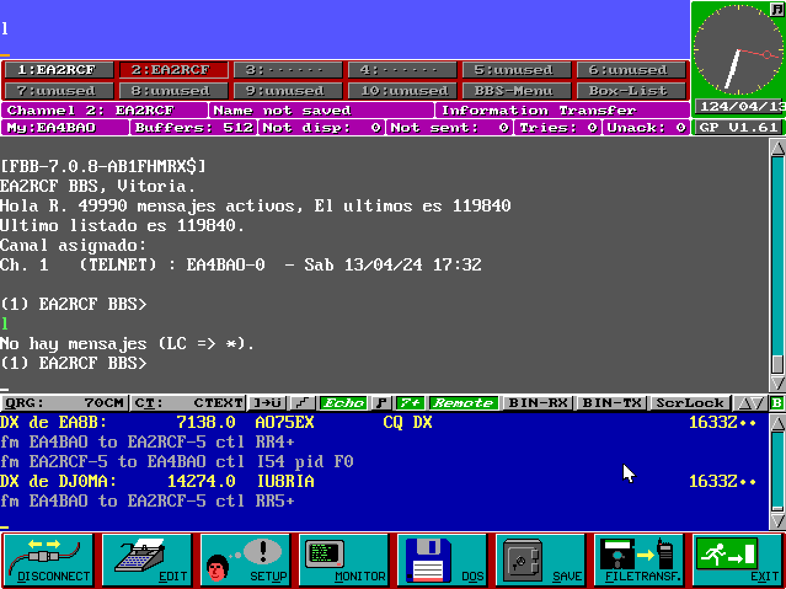
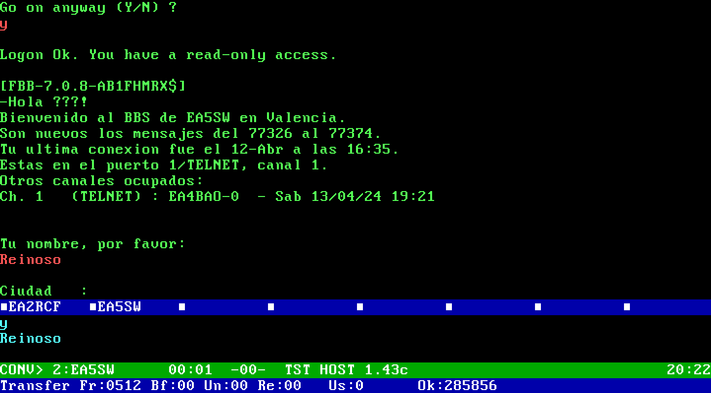
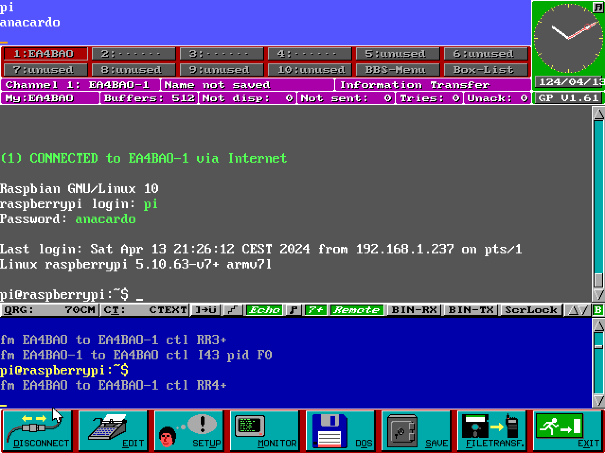
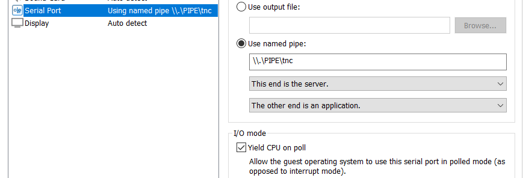

# TNC Telnet

An AX.25 emulator for TCP connections.

This interface emulates WA8DED's *The Firmware* TNC and makes regular Telnet traffic appears like AX.25.

## Description

You can use it to connect to any active F6FBB BBS via **Telnet** using Packet Radio software with support for TNC driver.

Like **Graphic Packet**:




Or **TSTHOST**:



You only need a Virtual Machine with the software, an Internet connection and run this program.

The emulator runs in the host system. Guest system's COM port is mapped to a named pipe in the host where this software is listening. See **Setup** section below.

Monitor is also simulated, but quite convincing:


Remember this is TCP/IP traffic in reality.

However, since this is basically a telnet client, you can use it to connect to **any** telnet server:




## Usage

### Known stations

Create a new file or edit `stations.json`. Configure TCP/IP data for known stations.

Example:

```json
{
    "EA4BAO":   "localhost:6300",
    "EA2RCF":   "cqnet.dyndns.org:6300",
    "EA2RCF-5": "cqnet.dyndns.org:7300",
    "EA5SW":    "ea5sw.ddns.net:6300"
}
```

### Command line

To launch the TNC emulator:

```
python tnc
```

For help:

```
python tnc -h
```


## Setup

### Virtual machine

Create a virtual machine. Configure its serial port as a named pipe:



Add a floppy drive.


Get some MS-DOS floppy images. Install the system.

Install and configure your most nostalgic packet program.

### Tips for TSTHOST

1. Configure CKJ driver using `ckbiocfg`. Use COM1, address `3F8H`, IRQ 4.
1. Load the driver in memory running `gkjbios`.
1. Launch TSTHOST like this:

  ```
  TSTHOST /H /C1 /B9600
  ```


### Tips for Graphic Packet

Edit `config.gp` and set up 1200 bauds.

## Caveats

This software only runs on Windows for now. To run it in Linux you'd need to adapt the channel module. TCP sockets error codes are quite different between Linux and Windows.

